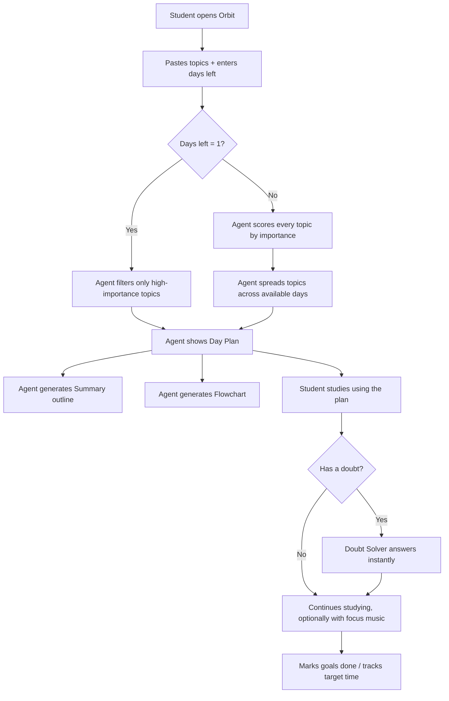

# Project Report: Orbit — Study Planner AI Agent

*Work Education Activity — IT Subject*

> Fill in the bracketed `[ ]` parts with your own details, then export this as a PDF (open it in a Markdown viewer, VS Code, or paste into Word/Google Docs) and add your screenshots where marked. Keep or edit any wording so it sounds like you.

**Name:** [Your Name]
**Class / Section:** [ ]
**Roll No.:** [ ]
**Subject:** Information Technology
**Teacher:** [ ]
**Date:** [ ]

---

## 1. Problem Statement

Students often struggle to organize their study time effectively, especially close to exams. Common problems include:
- Not knowing which topics matter most when time is short.
- Losing focus while studying (switching apps to play music, breaking concentration).
- Getting stuck on a doubt with no one to ask immediately.
- Not tracking daily study goals or how much time was actually spent on a task.

**Goal:** Design and build a simple AI-style agent — a *Study Planner* — that helps a student plan what to study based on how many days are left, answers quick doubts instantly, and keeps them focused, all in one place, without needing to code anything to use it.

## 2. Objective

To build a working AI/agent-based tool that:
1. Takes a list of topics and days remaining, and outputs a realistic study plan.
2. Prioritizes important topics automatically when time is very short.
3. Answers simple doubts instantly (offline) and can connect to a real AI model online.
4. Helps the student stay organized with reminders, goals, and a distraction-free music player.

## 3. Tools & Technologies Used

| Tool | Purpose |
|---|---|
| HTML5 | Page structure |
| CSS3 (custom properties, animations, Grid/Flexbox) | Cosmic dark-mode UI, multiple themes, responsive layout |
| JavaScript (vanilla, no framework) | App logic: planner algorithm, doubt solver, music player, storage |
| Canvas API | Animated starfield background |
| Web Storage API (`localStorage`) | Saving pins, goals, targets, theme & settings in the browser |
| [Your code editor, e.g. VS Code] | Writing and editing the code |
| [Browser used for testing, e.g. Google Chrome] | Running and testing the agent |
| GitHub Pages *(optional)* | Free online hosting so the agent works over the internet |
| OpenAI-compatible API *(optional)* | Lets the Doubt Solver / Planner use a real online AI model |

*(This satisfies the "no-code/low-code or basic Python/AI tools" requirement — the agent is built with front-end web technologies that need no installation, and optionally plugs into an online AI API — no C/C++/Java used.)*

## 4. Workflow / How the Agent Works

**Step-by-step:**
1. **Define the problem** — students need a fast, personalized study plan and a way to clear doubts without breaking focus.
2. **Plan the workflow** — decide inputs (topics, days left), the decision rule (1 day → priority-only list; more days → spread + revision day), and outputs (day plan, summary, flowchart).
3. **Build the agent** — implemented in HTML/CSS/JS as described in Section 3.
4. **Test** — entered real topics from [subject/chapter you tested with] with different day counts (1, 3, 7) and checked the output made sense.
5. **Refine** — based on test runs, [describe any changes you made — e.g. "adjusted the importance keyword list", "made the 1-day plan show more topics", "fixed the dashboard pin colors"].

## 5. Features Implemented

- [x] AI-style Study Planner (day-by-day plan, summary, flowchart)
- [x] Instant Doubt Solver (offline + optional online AI)
- [x] Built-in focus music player
- [x] Pinned exam/assignment/event reminders with urgency colors
- [x] Daily Goals checklist + Targets with time-limit countdown
- [x] Analog + digital clock
- [x] Dynamic animated cosmic background with scroll parallax
- [x] 5 switchable themes (Cosmos, Nebula, Ocean, Forest, Sunset)
- [x] Works online (deployable via GitHub Pages) and offline in the browser

## 6. Screenshots

*(Take these directly from the running app — press a screenshot shortcut, or use your browser's full-page screenshot tool.)*

**Dashboard (Cosmos theme)**
`[insert screenshot]`

**Study Planner — Day Plan**
`[insert screenshot]`

**Study Planner — Flowchart view**
`[insert screenshot]`

**Doubt Solver in action**
`[insert screenshot]`

**Focus Music player**
`[insert screenshot]`

**A different theme (e.g. Ocean/Sunset)**
`[insert screenshot]`

## 7. Testing & Refinement

| Test case | Input | Expected output | Result |
|---|---|---|---|
| 1 day left | 6 topics, 1 day | Only high-priority topics shown | [Pass/Fail + note] |
| Multiple days | 6 topics, 3 days | Topics spread across days + final revision day | [Pass/Fail + note] |
| Doubt solver — maths | `12*(4+3)` | Correct calculation shown instantly | [Pass/Fail] |
| Doubt solver — general | "How to study for an exam" | Useful study tip shown | [Pass/Fail] |
| Theme switch | Click each theme | Colors and starfield update immediately | [Pass/Fail] |
| Pin reminder | Add exam 3 days away | Shown with correct day count and warning color | [Pass/Fail] |
| Music player | Play a track | Track plays, equalizer animates, next/prev work | [Pass/Fail] |

**Refinements made after testing:** [Describe 2-3 real things you noticed and fixed/improved while testing — this shows the iterative design process the activity asks for.]

## 8. Conclusion

Orbit demonstrates how a simple rule-based "AI" agent — combined with an optional connection to a real AI model — can genuinely help solve a everyday student problem: deciding what to study when time is limited, while keeping focus tools (music, doubt-clearing, goal tracking) in one place. It required no-code/low-code effort to *use*, and shows the core agent-design ideas: defining a clear problem, planning a decision workflow, building it, and refining it from real test runs.

## 9. Live Demo Link *(optional)*

If hosted: `https://[your-username].github.io/[repo-name]/`

---
*Submitted for the Work Education (IT) activity.*
